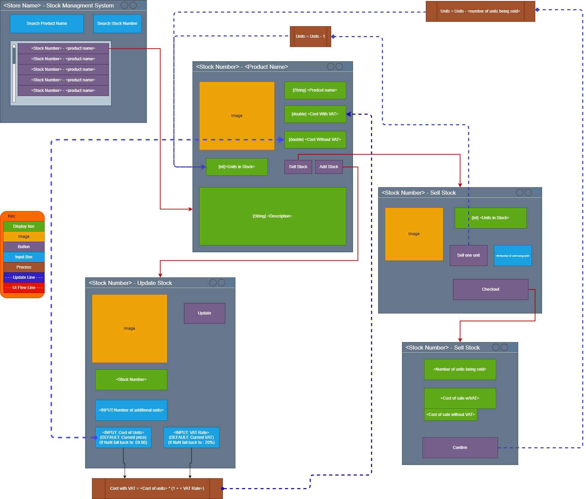

# Stock Management System
`OOSD Y1 Java Assessment`

---

### Usage

### UML

---
### Deliverables (Checklist)
This is a checklist to ensure that all the deliverables are present before submission
#### Github
- [ ] The GitHub repository should have a proper README file
describing 
  - [ ] the project, 
  - [ ] setup instructions 
  - [ ] usage details

- [ ] The repository should include 
  - [ ] the completed project source code for Java, 
  - [ ] strictly following PEP8 style guidelines to ensure clean, readable, and maintainable code.- 

- [ ] The code must include 
  - [ ] clear and concise comments
  - [ ] docstrings explaining the purpose and functionality of all functions and classes.

#### Test Cases

- [ ] Suitable test cases have been identified and documented
 Total more than 10 and less than 15 testcases provided for the project

#### UML diagrams
- [ ] Provide appropriate UML diagrams related to the project with appropriate connections

#### Video Demo
- [ ] You are required to submit a 5-minute video demonstration, in
which you will demonstrate to a technical audience how your
project works. Your presentation should cover the following points.`NOTE: Do NOT make a powerpoint`
    - [ ] Completed GUI based Application running in the system and explaining
        how the classes are working
    - [ ] Showing that easily you can add stock and sell stock.
    - [ ] Showing list of the stock.
    - [ ] You need to show classes and GUI working properly in demo .
    - [ ] Code explanation in detail
