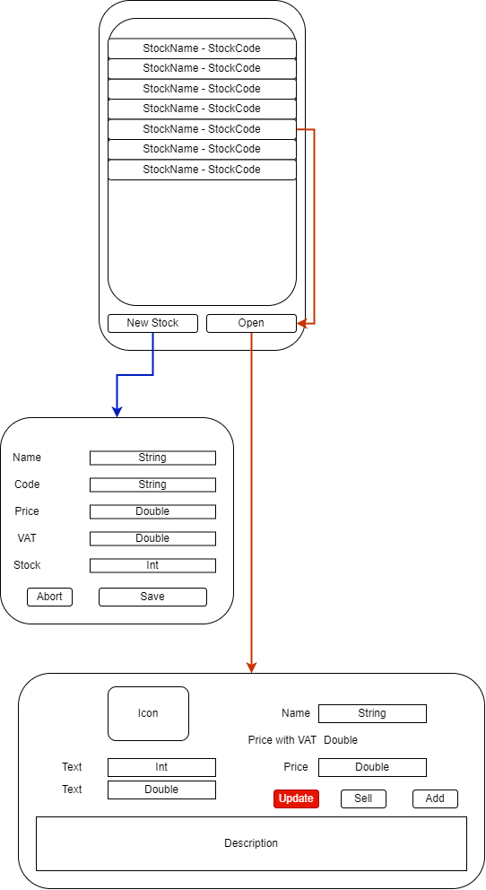
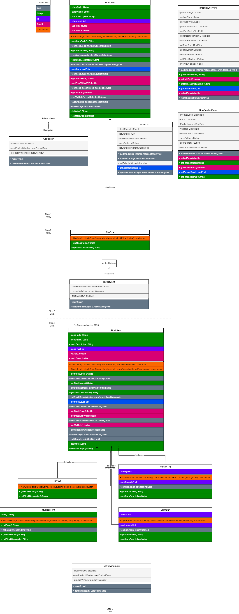

# Stock Management System
`OOSD Y1 Java Assessment`

---
### Setup

1. Download ZIP 
2. Extract Zip 
3. 

### Usage

### UML

---
## Bibliography

## Video tutorials
| Title                                                | Author                     | Link                                      | Accessed date        |
|------------------------------------------------------|----------------------------|-------------------------------------------|----------------------|
| Learn INTERFACES in 6 minutes!.                      | BroCode(2024).             |Available from https://youtu.be/c2sTQk9opO8| [Accessed 14 April 2026] 
| Learn Java arraylists in 9 minutes!.                 | BroCode(2024).             |Available from https://youtu.be/wsTSREgCE5E| [Accessed 15 April 2026] 
| Java login system.                                   | BroCode(2020).             |Available from https://youtu.be/Hiv3gwJC5kw| [Accessed 15 April 2026] 
| Java static keyword.                                 | BroCode(2020).             |Available from https://youtu.be/wa1HzkMqY9A| [Accessed 16 April 2026] 
| Java method overriding.                              | BroCode(2020).             |Available from https://youtu.be/E-0MMeNi5Cw| [Accessed 16 April 2026] 
| Java polymorphism.                                   | BroCode(2020).             |Available from https://youtu.be/2hkngtWLGvE| [Accessed 16 April 2026] 
| ActionListener \| Java Swing Tutorial for Beginners. | Java Code Junkie (2021).   |Available from https://youtu.be/ObVnyA8ar6Q| [Accessed 16 April 2026]
| Separating GUI and Logic code.                       | Nathaly Verwaal(2017).     |Available from https://youtu.be/881IYh7TQso| [Accessed 16 April 2026]
| Java super keyword                                   | BroCode(2020).             |Available from https://youtu.be/oKZnHNM9Ew4| [Accessed 21 April 2026]

### Key text tutorials 
Build UI using Swing. JetBrains(2025). Available from https://www.jetbrains.com/help/idea/design-gui-using-swing.html [Accessed 27 March 2026]

### Tools Used 
- JetBrains IntelliJ IDEA 2025.2.2 (Ultimate Edition). Available from https://www.jetbrains.com/idea/
- JetBrains Swing UI Designer 261.22158.182 .          Available from https://plugins.jetbrains.com/plugin/25304-swing-ui-designer
- Draw.io                                              Available from https://www.drawio.com

---
### Deliverables (Checklist)
This is a checklist to ensure that all the deliverables are present before submission
#### Github
- [ ] The GitHub repository should have a proper README file
describing 
  - [ ] the project, 
  - [ ] setup instructions 
  - [ ] usage details

- [ ] The repository should include 
  - [ ] the completed project source code for Java, 
  - [ ] strictly following PEP8 style guidelines to ensure clean, readable, and maintainable code.- 

- [ ] The code must include 
  - [ ] clear and concise comments
  - [ ] docstrings explaining the purpose and functionality of all functions and classes.

#### Testing

| Test Case | What will be done                     | Expected Result                                                                                      | Actual Result                                                                                                        | PASS/FAIL |
| --------- | ------------------------------------- | ---------------------------------------------------------------------------------------------------- | -------------------------------------------------------------------------------------------------------------------- | --------- |
| GUI1      | Create multiple StockItem objects     | List will have more than one row                                                                     | ![[Pasted image 20260418201745.png]]                                                                                 | PASS      |
| GUI2      | Add stock  From 6 to 10            | Overview will show the updated stock when updated and reopened                                       | ![[Pasted image 20260418201931.png]]                                                                                 | PASS      |
| GUI3      | Sell Stock                            | TODO                                                                                                 |                                                                                                                      | FAIL      |
| GUI4      | Change item prices From 100 to 200 | Price will show 200 and price inc VAT will show 240 after updating and reopening the overview        | ![[Pasted image 20260418202101.png]]                                                                                 | PASS      |
| GUI5      | Display updated item details          | Make any change and show it as working in the GUI. In this test I changed the stock from 10 to 20 | ![[Pasted image 20260418202148.png]] ![[Pasted image 20260418202248.png]] ![[Pasted image 20260418202303.png]] |           |
|           |                                       |                                                                                                      |                                                                                                                      |           |

#### Test Cases

- [ ] Suitable test cases have been identified and documented
 Total more than 10 and less than 15 testcases provided for the project

#### UML diagrams
- [ ] Provide appropriate UML diagrams related to the project with appropriate connections

#### Video Demo
- [ ] You are required to submit a 5-minute video demonstration, in
which you will demonstrate to a technical audience how your
project works. Your presentation should cover the following points.`NOTE: Do NOT make a powerpoint`
    - [ ] Completed GUI based Application running in the system and explaining
        how the classes are working
    - [ ] Showing that easily you can add stock and sell stock.
    - [ ] Showing list of the stock.
    - [ ] You need to show classes and GUI working properly in demo .
    - [ ] Code explanation in detail
